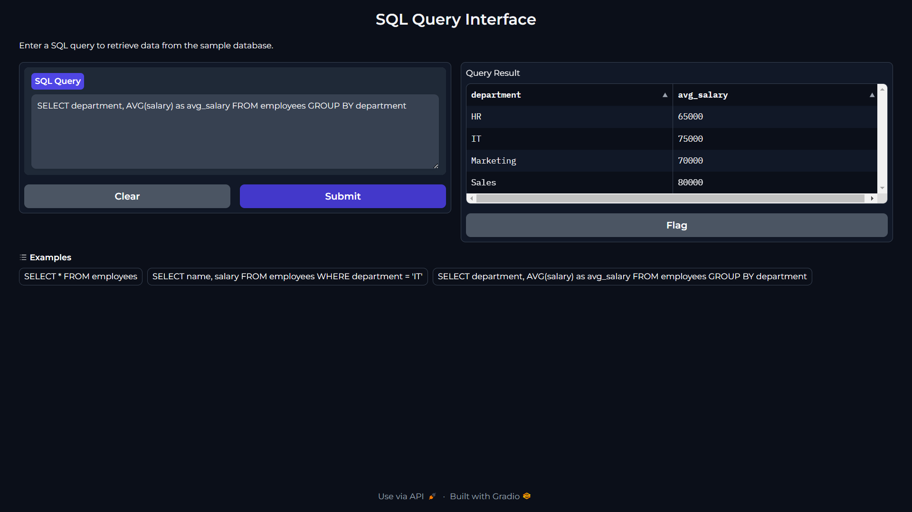

# Gradio SQL Query Interfaces

This repository contains two Gradio applications for executing SQL queries: one for SQLite and another for BigQuery.



## Setup Environment

pip install virtualenv
virtualenv <your-env>
<your-env>\Scripts\activate

## Requirements

- Python 3.11.4+
- gradio
- pandas
- sqlite3 (for SQLite interface)
- google-cloud-bigquery (for BigQuery interface)

### Install the required packages using:

```pip install -r requirements.txt```

## SQLite Query Interface (gradio_sql.py)

This application allows you to execute SQL queries on a sample SQLite database.

### Features:
- In-memory SQLite database with sample employee data
- Execute SQL queries and view results in a dataframe
- User-friendly interface with example queries

### Usage:
1. Run the script:
   
   ```python gradio_sql.py```
   
2. Open the provided URL in your web browser
3. Enter your SQL query in the text box
4. Click "Submit" to see the results

## BigQuery SQL Interface (gradio_bigquery.py)

This application allows you to execute SQL queries on your BigQuery dataset.

### Features:
- Connect to your BigQuery project
- Execute SQL queries and view results in a dataframe
- User-friendly interface with example queries

### Prerequisites:
- Google Cloud account with BigQuery enabled
- Google Cloud credentials properly set up

### Usage:
1. Ensure your Google Cloud credentials are set up correctly
2. Run the script:
   
   ```python gradio_bigquery.py```
   
3. Open the provided URL in your web browser
4. Enter your BigQuery SQL query in the text box
5. Click "Submit" to see the results

## Note

Make sure to replace the example queries in the BigQuery interface with queries that match your project, dataset, and table names.
